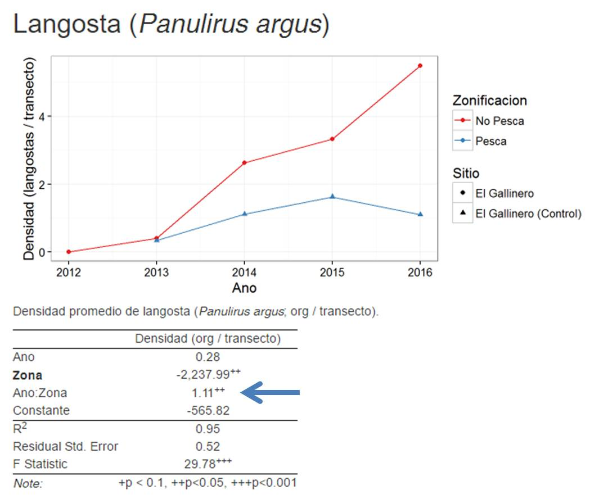

Se presentanlos análisis de los indicadores biolofísicos (Densidad, Riqueza, Biomasa y Nivel trófico) para las Zonas de Refugio Pesquero (9) establecidas en tres comunidades de Quintana Roo.

## Interpretación de los análisis

Los análisis se realizan con un modelo lineal múltiple, correlacionando el indicador con Año y Zona (Pesca vs. Reserva). El valor de interés para los análisis es el coeficiente de "Zona". Un valor positivo indica que el valor del indicador es mayor para la reserva. Si el coeficiente es significativo, se presentan indicadores a su lado con dos asteriscos (\*\*) para p < 0.05.

```{r, echo = F, out.width = 600, fig.retina = NULL, fig.cap="Por ejemplo, se presentan los resultados para la densidad de langosta (*Panulirus argus*) en El Gallinero, Maria Elena. Se presenta también la tabla de resultados, donde la flecha azul señala el valor del coeficiente de Zona. Los asteriscos a los lados indican que el valor es significativo (p < 0.05)"}


```

# Links a páginas por Comunidad y Sitio

## Maria Elena

[El Gallinero](ReporteMaria ElenaEl Gallinero.html)

[El Cabezo](ReporteMaria ElenaEl Cabezo.html)

[Punta Loria](ReporteMaria ElenaPunta Loria.html)


## Banco Chinchorro

[40 Canones Norte](ReporteBanco ChinchorroZRP40 Cañones Norte.html)

[40 Canones Sur](ReporteBanco ChinchorroZRP40 Cañones Sur.html)

[Zona Nucleo Cayo Norte](ReporteBanco ChinchorroZona Nucleo Cayo Norte.html)


## Punta Herrero

[Anegado de Chal](ReportePunta HerreroAnegado de Chal.html)

[El Faro](ReportePunta HerreroEl Faro,html)

[Manchon](ReportePunta HerreroManchon.html)
