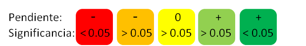

# Análisis de Zonas de Refugio Pesquero de Quintana Roo

Se presentanlos análisis de los indicadores biolofísicos (Densidad, Riqueza, Biomasa y Nivel trófico) para las Zonas de Refugio Pesquero (8) establecidas en tres comunidades de Quintana Roo.

## Interpretación de los análisis

Los análisis se realizan con un modelo lineal múltiple, correlacionando el indicador con Año y Zona (Pesca vs. Reserva) e incluyendo un término de interacción. El valor de interés para los análisis es el coeficiente de "Zona". Un valor positivo indica que el valor del indicador es mayor para la reserva. Si el coeficiente es significativo, se presentan indicadores a su lado con dos símbolos "+" para p < 0.01, "++" para p < 0.05 y "+++" para p < 0.001.

Como resumen, cada sitio tiene una tabla con los indicadores evaluados y un código de color, que deberá ser interpretado de la siguiente manera:



Además, se presentan los resultados cada indicador con una gráfica y una tabla de resumen para el modelo ajustado. Por ejemplo, para la densidad de langosta (*Panulirus argus*) en El Gallinero, Maria Elena. Abajo se observa la tabla de resultados, donde la flecha azul señala el valor del coeficiente de Zona. Los asteriscos a los lados indican que el valor es significativo (p < 0.05)

```{r, echo = F, out.width = 600, fig.retina = NULL}

knitr::include_graphics("./ejemplo.jpg")
```


    
        
        
# Links a páginas por Comunidad y Sitio

## Maria Elena

[El Gallinero](ReporteMaria ElenaEl Gallinero.html)

[Cabezo](ReporteMaria ElenaCabezo.html)

[Punta Loria](ReporteMaria ElenaPunta Loria.html)

[San Roman](ReporteMaria ElenaSan Roman.html)


## Banco Chinchorro

[40 Canones Norte](ReporteBanco ChinchorroZRP40 Cañones Norte.html)

[40 Canones Sur](ReporteBanco ChinchorroZRP40 Cañones Sur.html)

[Zona Nucleo Cayo Norte](ReporteBanco ChinchorroZona Nucleo Cayo Norte.html)


## Punta Herrero

[El Faro](ReportePunta HerreroEl Faro.html)

[Manchon](ReportePunta HerreroManchon.html)

# Tiempo de recuperación

[Langosta](K_langosta.html)
